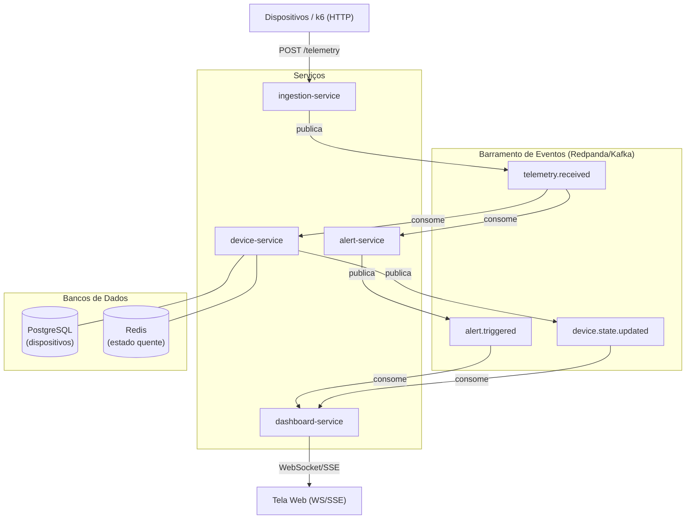

# Plataforma de Telemetria IoT — Portfólio DevOps

[](https://github.com/StartDevOpss/telemetry-roadmap/actions/workflows/ci.yml)

> Plataforma que ingere telemetria de milhares de dispositivos em tempo real, dispara alertas por regras e exibe o estado num dashboard. Foco em **DevOps/SRE**, 100% gratuita e rodando localmente. O domínio IoT foi escolhido porque a arquitetura orientada a eventos se justifica sozinha: alto volume de eventos contínuos é o estado normal do sistema, não uma exceção.

---

## Visão Geral da Arquitetura

Todos os serviços se comunicam **exclusivamente por eventos** — sem chamadas HTTP diretas entre si. Cada leitura de dispositivo percorre o barramento e aciona serviços independentes de forma assíncrona.



---

## Serviços

| Serviço | Responsabilidade | Publica | Consome |
|---|---|---|---|
| **ingestion-service** | Ponto de entrada HTTP; valida e publica telemetria bruta | `telemetry.received` | — |
| **device-service** | Persiste estado do dispositivo (PostgreSQL + Redis) | `device.state.updated` | `telemetry.received` |
| **alert-service** | Motor de regras (bateria baixa, temperatura alta, excesso de velocidade) | `alert.triggered` | `telemetry.received` |
| **dashboard-service** | Expõe estado em tempo real via WebSocket/SSE | — | `device.state.updated`, `alert.triggered` |

---

## Stack Tecnológica

| Camada | Ferramenta | Por quê |
|---|---|---|
| Linguagem | **Go** | Imagens minúsculas (`distroless`), startup < 1s, linguagem nativa do ecossistema cloud-native |
| Mensageria | **Redpanda** | Compatível com Kafka, consumo de RAM muito menor — ideal para dev local |
| Banco de dados | **PostgreSQL** | Estado persistido dos dispositivos |
| Cache / estado quente | **Redis** | Último estado de cada device em memória, baixíssima latência |
| Containers | **Docker + Docker Compose** | Dev local e testes de integração |
| Kubernetes | **kind** | Kubernetes local gratuito, mesmos conceitos do EKS/GKE |
| CI/CD | **GitHub Actions** | Gratuito em repositórios públicos |
| Registry de imagens | **ghcr.io** | Gratuito com GitHub |
| GitOps | **ArgoCD** | Roda no próprio cluster, gratuito |
| IaC | **Terraform / OpenTofu** | Gratuito |
| Observabilidade | **Prometheus + Grafana + Loki + OpenTelemetry + Tempo** | Stack completa de três pilares |
| Teste de carga | **k6** | Simula milhares de dispositivos em paralelo |
| Varredura de segurança | **Trivy** | Gratuito, integra com CI |

---

## Roadmap

| Fase | Objetivo | Status |
|---|---|---|
| **0 — Fundação** | Monorepo, diagrama de arquitetura, contratos de eventos | ✅ Concluída |
| **1 — Serviços + Event-driven** | 4 serviços rodando e se comunicando via Redpanda (Docker Compose) | 🔲 Pendente |
| **2 — Containerização + Kubernetes** | Imagens multi-stage, manifests k8s, probes, resource limits | 🔲 Pendente |
| **3 — CI/CD** | GitHub Actions: build → lint → scan (Trivy) → push para ghcr.io | ✅ Concluída |
| **4 — Observabilidade** | Dashboards Grafana, logs Loki, traces distribuídos entre serviços | 🔲 Pendente |
| **5 — IaC + GitOps** | Terraform + Helm + ArgoCD sincronizando cluster com Git | 🔲 Pendente |
| **6 — Resiliência + Autoscaling** | k6 simulando pico de dispositivos, HPA, chaos engineering | 🔲 Pendente |
| **7 — Polimento do Portfólio** | Métricas de efeito, GIFs dos dashboards, post de arquitetura | 🔲 Pendente |

---

## Início Rápido

```bash
# Fase 1+ — subir tudo localmente
docker compose up -d --build

# Enviar telemetria de teste
curl -X POST http://localhost:8081/telemetry \
  -H "Content-Type: application/json" \
  -d '{"device_id":"device-001","payload":{"lat":-15.62,"lon":-47.66,"battery":0.18,"temperature_c":42.5,"speed_kmh":95}}'

# Ver logs de todos os serviços
docker compose logs -f
```

---

## Contratos de Eventos

Veja [docs/events/contracts.md](docs/events/contracts.md) para as definições completas de schema.

---

## Decisões de Design

- **Por que Redpanda em vez de Kafka?** Mesma API, consumo de RAM 10x menor — ideal para rodar localmente em uma única máquina.
- **Por que Go?** Imagens mínimas (< 10 MB com `distroless`), startup quase instantâneo, ecossistema cloud-native nativo (Kubernetes, Prometheus e Docker são escritos em Go).
- **Por que event-driven (sem HTTP entre serviços)?** Desacoplamento — o `device-service` e o `alert-service` processam o mesmo evento `telemetry.received` de forma completamente independente. Falha em um não afeta o outro.
- **Por que IoT/telemetria?** O volume contínuo e alto de eventos torna a arquitetura orientada a eventos naturalmente justificável — não é forçado como em CRUDs simples.

---

## Log de Decisões de Arquitetura (ADRs)

| # | Decisão | Justificativa |
|---|---|---|
| ADR-001 | Toda comunicação entre serviços via eventos | Desacoplamento, deployabilidade independente, isolamento de falhas |
| ADR-002 | Redpanda como barramento de eventos | Compatível com Kafka, mais leve para dev local |
| ADR-003 | Go como linguagem principal | Imagens mínimas, startup rápido, ecossistema cloud-native |
| ADR-004 | Estrutura de monorepo | Tooling simplificado, pipeline CI único, commits atômicos |
| ADR-005 | Chave de partição = `device_id` | Garante ordenação de eventos por dispositivo |
| ADR-006 | Consumers idempotentes via `event_id` | Segurança contra duplicatas — obrigatório para entrega at-least-once |
| ADR-007 | Redis para estado quente dos dispositivos | Leitura de último estado em < 1ms sem pressionar o PostgreSQL |

---

## Métrica Alvo do Portfólio

> *"Construí uma plataforma de telemetria IoT orientada a eventos com 4 microsserviços desacoplados processando dados de dispositivos em tempo real via Kafka/Redpanda, deployada em Kubernetes via GitOps, com CI/CD automatizado, observabilidade completa (métricas, logs, traces distribuídos) e teste de carga simulando milhares de dispositivos — tudo como código, do zero."*
