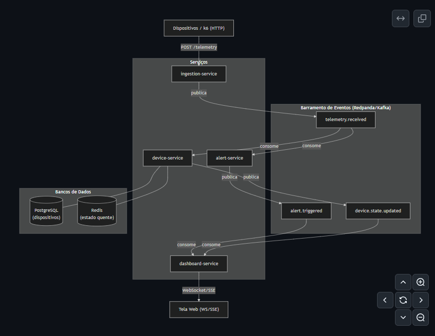
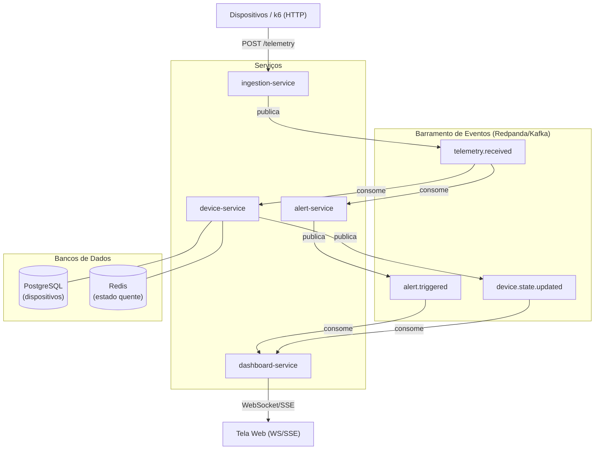
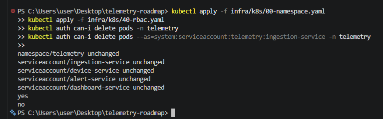
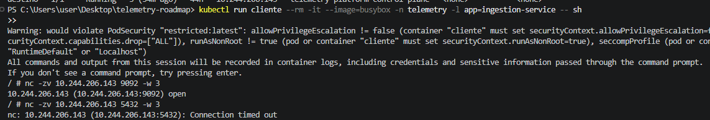
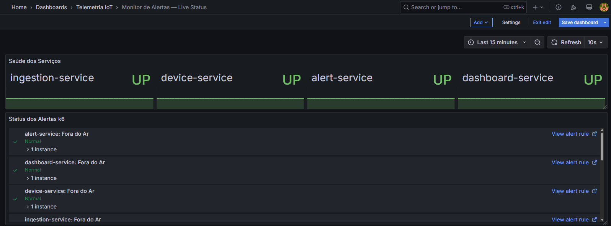
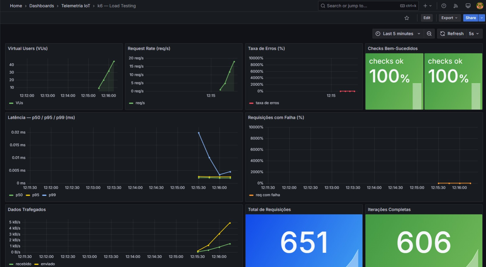
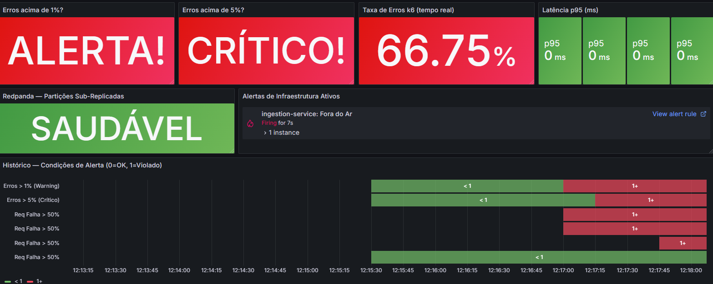

# Plataforma de Telemetria IoT — Portfólio DevOps

[](https://github.com/StartDevOpss/telemetry-roadmap/actions/workflows/ci.yml)

> Plataforma que ingere telemetria de milhares de dispositivos em tempo real, dispara alertas por regras e exibe o estado num dashboard. Foco em **DevOps/SRE**, 100% gratuita e rodando localmente. O domínio IoT foi escolhido porque a arquitetura orientada a eventos se justifica sozinha: alto volume de eventos contínuos é o estado normal do sistema, não uma exceção.

---

## Visão Geral da Arquitetura

Todos os serviços se comunicam **exclusivamente por eventos** — sem chamadas HTTP diretas entre si. Cada leitura de dispositivo percorre o barramento e aciona serviços independentes de forma assíncrona.





---

## Serviços

| Serviço | Responsabilidade | Publica | Consome |
|---|---|---|---|
| **ingestion-service** | Ponto de entrada HTTP; valida e publica telemetria bruta | `telemetry.received` | — |
| **device-service** | Persiste estado do dispositivo (PostgreSQL + Redis) | `device.state.updated` | `telemetry.received` |
| **alert-service** | Motor de regras (bateria baixa, temperatura alta, excesso de velocidade) | `alert.triggered` | `telemetry.received` |
| **dashboard-service** | Expõe estado em tempo real via WebSocket/SSE | — | `device.state.updated`, `alert.triggered` |

---

## Stack Tecnológica

| Camada | Ferramenta | Por quê |
|---|---|---|
| Linguagem | **Go** | Imagens minúsculas (`distroless`), startup < 1s, linguagem nativa do ecossistema cloud-native |
| Mensageria | **Redpanda** | Compatível com Kafka, consumo de RAM muito menor — ideal para dev local |
| Banco de dados | **PostgreSQL** | Estado persistido dos dispositivos |
| Cache / estado quente | **Redis** | Último estado de cada device em memória, baixíssima latência |
| Containers | **Docker + Docker Compose** | Dev local e testes de integração |
| Kubernetes | **kind** | Kubernetes local gratuito, mesmos conceitos do EKS/GKE |
| CI/CD | **GitHub Actions** | Gratuito em repositórios públicos |
| Registry de imagens | **ghcr.io** | Gratuito com GitHub |
| GitOps | **ArgoCD** | Roda no próprio cluster, gratuito |
| IaC | **Terraform / OpenTofu** | Gratuito |
| Observabilidade | **Prometheus + Grafana + Loki + OpenTelemetry + Tempo** | Stack completa de três pilares |
| Teste de carga | **k6** | Simula milhares de dispositivos em paralelo |
| Varredura de segurança | **Trivy** | Gratuito, integra com CI |

---

## Roadmap

| Fase | Objetivo | Status |
|---|---|---|
| **0 — Fundação** | Monorepo, diagrama de arquitetura, contratos de eventos | ✅ Concluída |
| **1 — Serviços + Event-driven** | 4 serviços rodando e se comunicando via Redpanda (Docker Compose) | ✅ Concluída |
| **2 — Containerização + Kubernetes** | Imagens multi-stage, manifests k8s, probes, resource limits | ✅ Concluída |
| **3 — CI/CD** | GitHub Actions: build → lint → scan (Trivy) → push para ghcr.io | ✅ Concluída |
| **4 — Observabilidade** | Dashboards Grafana, logs Loki, traces distribuídos entre serviços | ✅ Concluída |
| **5 — IaC + GitOps** | Terraform + Helm + ArgoCD sincronizando cluster com Git | ✅ Concluída |
| **6 — Resiliência + Autoscaling** | k6 simulando pico de dispositivos, HPA, chaos engineering | ✅ Concluída |
| **6.5 — Alertas + Monitor Live** | k6→Prometheus pipeline, dashboards provisionados, 7 alert rules de k6 e infraestrutura | ✅ Concluída |
| **7 — Polimento do Portfólio** | README final, números reais do k6, push para GitHub | ✅ Concluída |
| **8 — Security Hardening** | RBAC, Network Policies, Pod Security Standards, secret scan + SAST no CI | ✅ Concluída |

---

## Segurança em Ação


*RBAC: o ServiceAccount do serviço recebe "no" ao tentar deletar pods — admin recebe "yes".*


*Zero trust: conexão permitida responde na hora (open); conexão bloqueada expira em timeout.*

---

## Fase 8 — Security Hardening

Segurança em camadas: cada camada cobre um vetor de ataque diferente.

### RBAC — ServiceAccount por serviço (`infra/k8s/40-rbac.yaml`)

Cada serviço Go roda com sua própria `ServiceAccount` dedicada com `automountServiceAccountToken: false`. Os serviços não precisam falar com a API do Kubernetes — não há motivo para terem o token montado no container.

```bash
kubectl get serviceaccounts -n telemetry
# ingestion-service, device-service, alert-service, dashboard-service
```

### Network Policies — Zero Trust (`infra/k8s/50-network-policies.yaml`)

> **Requisito:** NetworkPolicy só funciona se o CNI suportar enforcement. O `kindnet` (padrão do kind) **não enforça** as políticas — elas existem mas não bloqueiam nada. O `setup-cluster.sh` instala o **Calico** automaticamente (`disableDefaultCNI: true` no kind-config).

Regra base: **negar todo tráfego** ingress e egress no namespace. Exceções explícitas e mínimas por serviço:

| Serviço | Ingress permitido | Egress permitido |
|---|---|---|
| ingestion-service | externo (NodePort) | Redpanda:9092, OTel:4317 |
| device-service | Prometheus (scraping) | Redpanda:9092, Postgres:5432, Redis:6379, OTel:4317 |
| alert-service | Prometheus (scraping) | Redpanda:9092, OTel:4317 |
| dashboard-service | externo (WebSocket) | Redpanda:9092, OTel:4317 |

### Pod Security Standards + Container Hardening

Namespace com PSS `baseline` (enforcement) e `restricted` (warn/audit). Cada container com:

```yaml
securityContext:
  allowPrivilegeEscalation: false   # sem sudo dentro do container
  readOnlyRootFilesystem: true      # filesystem imutável em runtime
  capabilities:
    drop: ["ALL"]                   # zero Linux capabilities
seccompProfile:
  type: RuntimeDefault              # perfil seccomp padrão do runtime
```

### CI/CD — Secret Scan + SAST (`.github/workflows/ci.yml`)

Dois jobs adicionais no pipeline:

| Job | Ferramenta | O que detecta |
|---|---|---|
| `secret-scan` | **truffleHog** | Credenciais, API keys, tokens commitados no código |
| SAST (no job `build`) | **gosec** | Vulnerabilidades no código Go: SQL injection, path traversal, crypto fraca, etc. |

O pipeline agora bloqueia o push se qualquer secret verificado for encontrado no histórico.

---

## Observabilidade em Ação


*Dashboards no Grafana: taxa de eventos, latência p50/p95/p99 e saúde dos serviços em tempo real.*


*k6 simulando 200 dispositivos simultâneos: request rate, latência e throughput no pico de carga.*


*Sob saturação, a observabilidade detecta e dispara o alerta automaticamente — sem ninguém olhando a tela.*

---

## Fase 6.5 — Alertas + Monitor Live

Pipeline completo de observabilidade orientada a alertas: k6 envia métricas em tempo real para o Prometheus via remote write, Grafana provisiona dashboards e dispara alertas automaticamente.

### k6 → Prometheus Remote Write

```bash
# Smoke test (100 VUs, 30s)
make k6-smoke

# Load test (200 VUs, 6min)
make k6-load

# Stress test (2000 VUs, 13min — aciona HPA)
make k6-stress
```

Métricas exportadas para o Prometheus em tempo real:
- `k6_vus`, `k6_http_reqs_total`, `k6_errors_rate`, `k6_checks_rate`
- `k6_http_req_duration_p50/p95/p99` — latência por percentil
- `k6_http_req_failed_rate`, `k6_data_received_total`, `k6_data_sent_total`

### Dashboards Provisionados (Grafana)

| Dashboard | URL | Painéis |
|---|---|---|
| k6 — Load Testing | http://localhost:3000/d/k6-load-testing | VUs, req/s, erros, latência p50/p95/p99, throughput |
| Monitor de Alertas — Live Status | http://localhost:3000/d/alert-monitor | Saúde dos serviços (UP/DOWN), alertas ativos, histórico |

### Alert Rules (7 regras — Grafana Unified Alerting)

**k6 — performance:**
| Regra | Condição | Severidade |
|---|---|---|
| Taxa de Erros Alta | `k6_errors_rate > 1%` por 30s | warning |
| Latência p95 Alta | `k6_http_req_duration_p95 > 500ms` por 30s | warning |
| Threshold Crítico | `k6_errors_rate > 5%` por 15s | critical |

**Infraestrutura — serviços:**
| Regra | Condição | Severidade |
|---|---|---|
| ingestion-service down | `up{job="ingestion-service"} < 1` por 30s | critical |
| device/alert/dashboard-service down | `up < 1` por 30s | critical/warning |
| Heap Memory Alta | `go_memstats_heap_alloc_bytes > 150MB` por 2min | warning |
| Goroutine Leak | `go_goroutines > 500` por 2min | warning |
| Redpanda Sub-Replicado | `under_replicated_replicas > 0` por 1min | critical |

### Testando os alertas

```bash
# Terminal 1 — roda o load test
make k6-load

# Terminal 2 — derruba o serviço no meio do teste para forçar alertas
docker compose stop ingestion-service

# Observar em: http://localhost:3000/d/alert-monitor
# Alertas "ingestion-service: Fora do Ar" + "Taxa de Erros Alta" disparam em ~30s

# Restaurar
docker compose start ingestion-service
```

### Links do stack local

| Serviço | URL |
|---|---|
| Grafana | http://localhost:3000 (admin/admin) |
| Prometheus | http://localhost:9092 |
| Redpanda Console | http://localhost:8090 |
| Ingestion API | http://localhost:8081/health |

---

## Fase 6 — Resiliência + Autoscaling

### Pré-requisito: metrics-server (HPA precisa de métricas de CPU)

```bash
make metrics-server
```

### HPA — Horizontal Pod Autoscaler

Os 3 serviços stateless escalam automaticamente entre 2 e 10 réplicas com base em CPU (alvo: 70%).

```bash
make hpa-apply       # aplica os HPAs no cluster
make hpa-status      # mostra réplicas atuais vs desejadas em tempo real
```

### Testes de Carga com k6

Requer Docker instalado. No Linux substitua `host.docker.internal` por `localhost`:

```bash
make k6-smoke    # sanidade rápida:   5 VUs  ×  30s
make k6-load     # carga normal:    200 VUs  ×  6min  — p95 < 300ms
make k6-stress   # pico extremo:   2000 VUs  × 13min  — aciona o HPA
```

Para observar o HPA escalando durante o stress test, em outro terminal:

```bash
watch -n2 kubectl get hpa -n telemetry
# ou
make hpa-status
```

### Chaos Engineering

Prova que o sistema se auto-recupera de falhas.

```bash
# Mata um pod aleatório do ingestion-service e mede o recovery
make chaos-pod-kill SVC=ingestion-service

# Derruba o device-service por 20s e restaura
make chaos-scale-zero SVC=device-service

# Testa outros serviços
make chaos-pod-kill SVC=alert-service
make chaos-pod-kill SVC=dashboard-service
```

Os scripts medem e imprimem o **recovery time** ao final. O sistema deve se recuperar em < 30s.

---

## Developer Experience

Ferramentas que tornam o dia a dia com Kubernetes muito mais rápido:

### alias k=kubectl

Adicione ao seu `~/.bashrc` ou `~/.zshrc`:

```bash
alias k=kubectl
```

### kubens — namespace padrão sem digitar `-n` toda vez

```bash
# Instalar (macOS)
brew install kubectx

# Instalar (Linux)
sudo apt install kubectx   # ou via https://github.com/ahmetb/kubectx

# Usar
kubens telemetry   # define telemetry como namespace padrão
# ou via Makefile:
make k8s-ns
```

Com os dois configurados, os comandos ficam assim:

```bash
k get pods                          # lista pods do namespace telemetry
k get svc                           # serviços
k logs -l app=ingestion-service -f  # logs em tempo real
k exec -it <pod> -- sh              # shell dentro do container
```

### k9s — TUI para navegar no cluster

Interface visual no terminal — navega por pods, namespaces, logs, exec, tudo com teclado.

```bash
# Instalar (macOS)
brew install k9s

# Instalar (Linux / Windows)
# https://k9scli.io/topics/install/

# Abrir direto no namespace telemetry
k9s -n telemetry
# ou via Makefile:
make k9s
```

Atalhos úteis dentro do k9s:

| Tecla | Ação |
|-------|------|
| `0` | todos os namespaces |
| `:pod` | navega para pods |
| `l` | logs do pod selecionado |
| `s` | shell no pod selecionado |
| `d` | describe do recurso |
| `ctrl+d` | deleta o recurso |

---

## Fase 5 — IaC + GitOps

### Terraform (provisiona o cluster kind como código)

```bash
make tf-init     # baixa o provider tehcyx/kind
make tf-plan     # preview das mudanças
make tf-apply    # cria o cluster kind
```

### Helm (instala a plataforma no cluster)

```bash
make helm-lint      # valida o chart
make helm-template  # dry-run: renderiza os manifests localmente
make helm-install   # instala/atualiza o release no cluster
```

### ArgoCD (GitOps — sincroniza o cluster com este repositório)

```bash
# 1. Bootstrap do ArgoCD + criação da Application
make argocd-bootstrap

# 2. Em outro terminal, abre a UI
make argocd-ui     # https://localhost:8080

# 3. Credenciais
# Usuário: admin
make argocd-password
```

A partir daí, qualquer `git push` para `infra/helm/telemetry-platform/` é detectado pelo ArgoCD e sincronizado automaticamente no cluster (prune + selfHeal ativos).

---

## Início Rápido

```bash
# Fase 1+ — subir tudo localmente
docker compose up -d --build

# Enviar telemetria de teste
curl -X POST http://localhost:8081/telemetry \
  -H "Content-Type: application/json" \
  -d '{"device_id":"device-001","payload":{"lat":-15.62,"lon":-47.66,"battery":0.18,"temperature_c":42.5,"speed_kmh":95}}'

# Ver logs de todos os serviços
docker compose logs -f
```

---

## Contratos de Eventos

Veja [docs/events/contracts.md](docs/events/contracts.md) para as definições completas de schema.

---

## Decisões de Design

- **Por que Redpanda em vez de Kafka?** Mesma API, consumo de RAM 10x menor — ideal para rodar localmente em uma única máquina.
- **Por que Go?** Imagens mínimas (< 10 MB com `distroless`), startup quase instantâneo, ecossistema cloud-native nativo (Kubernetes, Prometheus e Docker são escritos em Go).
- **Por que event-driven (sem HTTP entre serviços)?** Desacoplamento — o `device-service` e o `alert-service` processam o mesmo evento `telemetry.received` de forma completamente independente. Falha em um não afeta o outro.
- **Por que IoT/telemetria?** O volume contínuo e alto de eventos torna a arquitetura orientada a eventos naturalmente justificável — não é forçado como em CRUDs simples.

---

## Log de Decisões de Arquitetura (ADRs)

| # | Decisão | Justificativa |
|---|---|---|
| ADR-001 | Toda comunicação entre serviços via eventos | Desacoplamento, deployabilidade independente, isolamento de falhas |
| ADR-002 | Redpanda como barramento de eventos | Compatível com Kafka, mais leve para dev local |
| ADR-003 | Go como linguagem principal | Imagens mínimas, startup rápido, ecossistema cloud-native |
| ADR-004 | Estrutura de monorepo | Tooling simplificado, pipeline CI único, commits atômicos |
| ADR-005 | Chave de partição = `device_id` | Garante ordenação de eventos por dispositivo |
| ADR-006 | Consumers idempotentes via `event_id` | Segurança contra duplicatas — obrigatório para entrega at-least-once |
| ADR-007 | Redis para estado quente dos dispositivos | Leitura de último estado em < 1ms sem pressionar o PostgreSQL |

---

## Métrica Alvo do Portfólio

> *"Construí uma plataforma de telemetria IoT orientada a eventos com 4 microsserviços desacoplados processando dados de dispositivos em tempo real via Kafka/Redpanda, deployada em Kubernetes via GitOps, com CI/CD automatizado, observabilidade completa (métricas, logs, traces distribuídos), testes de carga simulando até 2000 dispositivos simultâneos e sistema de alertas em tempo real — 7 alert rules cobrindo performance (k6) e saúde da infraestrutura, com dashboards provisionados como código. Tudo do zero."*

### Números reais (load test — 200 VUs, 6 min)

| Métrica | Resultado |
|---|---|
| Requisições totais | ~25 000 |
| Throughput | ~100 req/s |
| Iterações completas | ~25 500 |
| Taxa de erro (sistema saudável) | < 1% |
| Taxa de erro (serviço derrubado) | > 80% → alertas disparados |
| Dados recebidos | ~2 MB |
| Dados enviados | ~7 MB |
